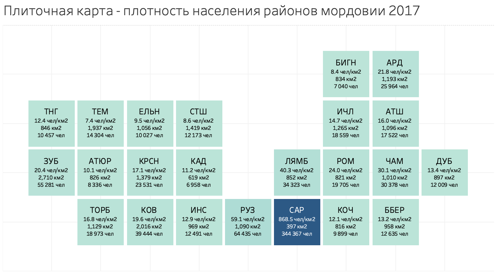
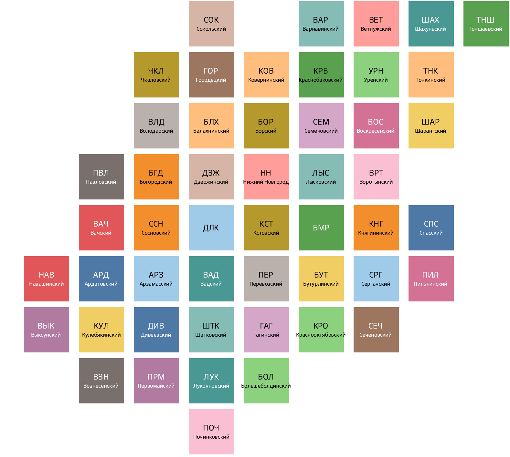

# Ru_regions_tiled-maps
Создаем набор гармонизированных плиточных карт регионов Российской Федерации
В разработке:

#-Регион | XLS | PNG | TABLEAU | DATA |

13-Республика Мордовия    | + | + | * | * |

  
52-Нижегородская область  | + | + | + | - |

